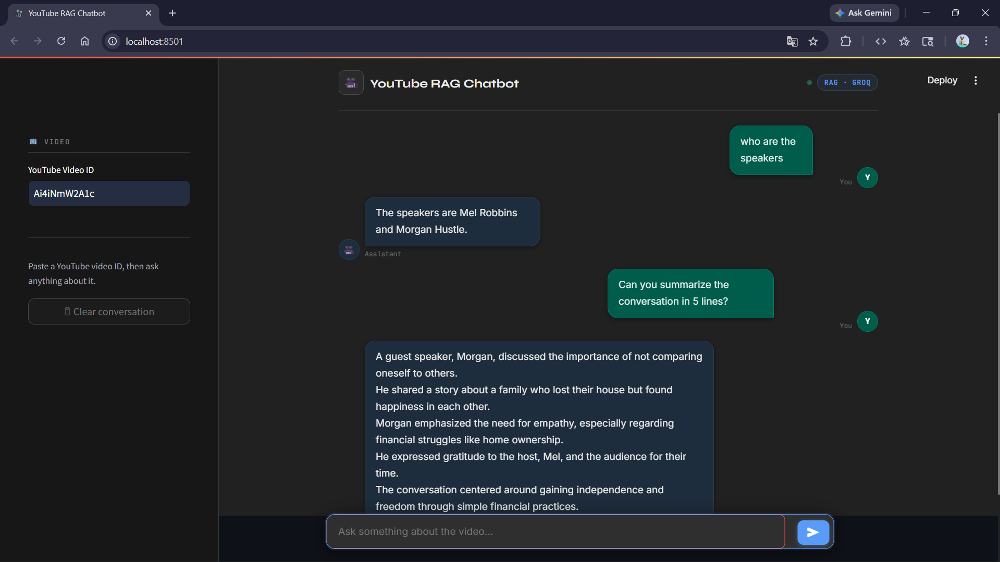

# Youtube Content Chatbot (RAG based)

## 📌 Project Overview
The **YouTube Content Chatbot** is a Retrieval-Augmented Generation (RAG) based conversational assistant that allows users to query and interact with the content of YouTube videos. By providing a YouTube video link, users can ask topic-specific questions, and the system retrieves relevant video transcript chunks and generates accurate, context-aware responses using a locally deployed Large Language Model (LLM).

This project leverages **Ollama (Mistral 7B)** as the LLM and is deployed locally using **Streamlit** for an interactive web-based interface.

---



---
## 🧠 Key Features
- 🔗 Accepts YouTube video links as input  
- 📄 Automatically loads and processes video transcripts  
- 🧩 Uses **Retrieval-Augmented Generation (RAG)** for precise answers  
- 🤖 Powered by **Ollama: Mistral 7B** (local LLM)  
- 💬 Conversational chatbot interface  
- 🖥️ Fully local deployment using **Streamlit**  
- 📦 Modular and extensible codebase  

---

## 🏗️ Project Structure
```
Youtube-Content-Chatbot-RAG-based-main/
├── app.py                     # Streamlit application entry point
├── requirements.txt           # Python dependencies
├── trial-rag-pipeline.ipynb   # Experimental RAG pipeline notebook
├── rag/
│   ├── loader.py              # Loads YouTube transcripts
│   ├── splitter.py            # Text chunking logic
│   ├── embeddings.py          # Embedding generation
│   ├── vectorstore.py         # Vector database management
│   ├── llm.py                 # Ollama LLM integration
│   ├── prompt.py              # Prompt templates
│   └── pipeline.py            # RAG orchestration pipeline
└── README.md
```

---

## ⚙️ Technology Stack
- **Python 3.10+**
- **Streamlit** – Web UI  
- **Ollama** – Local LLM runtime  
- **Mistral 7B** – Language model  
- **LangChain** – RAG framework  
- **FAISS / Vector Store** – Similarity search  
- **YouTube Transcript API**  

---

## 🚀 Installation

### 1️⃣ Clone the Repository
```bash
git clone <your-repository-url>
cd Youtube-Content-Chatbot-RAG-based-main
```

### 2️⃣ Create Virtual Environment (Optional)
```bash
python -m venv venv
source venv/bin/activate  # On Windows: venv\Scripts\activate
```

### 3️⃣ Install Dependencies
```bash
pip install -r requirements.txt
```

### 4️⃣ Install & Run Ollama
- Install Ollama from: https://ollama.com  
- Pull the Mistral model:
```bash
ollama pull mistral:7b
```

---

## ▶️ Usage

### Run the Streamlit App
```bash
streamlit run app.py
```

### Application Flow
1. Paste a **YouTube video link**
2. Ask questions related to the video content
3. The chatbot retrieves relevant transcript chunks
4. The LLM generates contextual answers

---

## 🧩 RAG Pipeline Overview
1. **Transcript Loader** – Fetches video transcripts  
2. **Text Splitter** – Breaks text into manageable chunks  
3. **Embeddings Generator** – Converts text into vector embeddings  
4. **Vector Store** – Stores and retrieves relevant chunks  
5. **LLM Generator** – Generates answers using retrieved context  

---

## 🛠️ Configuration
- LLM Model: `ollama:mistral/7b`
- Chunk size & overlap configurable in `splitter.py`
- Prompt templates customizable in `prompt.py`

---

## 🐞 Troubleshooting
- Ensure Ollama is running before starting the app
- Check transcript availability for the YouTube video
- Verify Python version compatibility
- If embeddings fail, clear vector store and retry

---

## 📌 Future Enhancements
- Multi-video knowledge base support  
- Chat history persistence  
- Source citation in responses  
- UI improvements  

## 👨‍💻 Contributors
- [@ash-iiiiish](https://github.com/ash-iiiiish)

---

## 📄 License
This project is licensed under the **MIT License**.

---

## ⭐ Acknowledgements
- Ollama  
- Mistral AI  
- LangChain  
- Streamlit  

---

> **Note:** This project runs fully locally and does not send data to external APIs.


